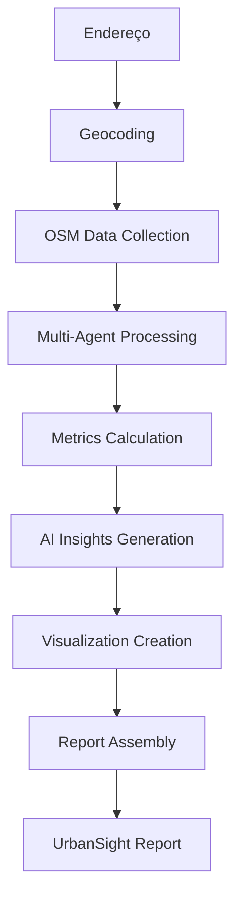

# 🏙️ UrbanSight - Inteligência Imobiliária

**A próxima geração em análise imobiliária inteligente**

Sistema revolucionário de análise de propriedades que combina **OpenStreetMap**, **Multi-Agentes IA** e **tecnologia de ponta** para gerar insights profundos sobre localização e investimento imobiliário.

---

## ✨ Por que UrbanSight?

### 🎯 **Para Investidores & Corretores**
- **Análise Instantânea**: Relatórios completos em segundos
- **Insights com IA**: Recomendações baseadas em dados reais
- **Métricas Profissionais**: Walk Score, acessibilidade, potencial de valorização
- **Visualizações Avançadas**: Mapas interativos e heatmaps inteligentes

### 🏠 **Para Compradores**
- **Interface Simples**: Digite apenas o endereço
- **Relatório Completo**: Tudo que você precisa saber sobre a localização
- **Perfil Ideal**: Descubra se o imóvel combina com seu estilo de vida
- **Análise de Vizinhança**: Entenda a região antes de decidir

---

## 🚀 Tecnologias de Ponta

### 🤖 **Sistema Multi-Agentes**
```
🗺️  OSM Data Collector     → Coleta dados geográficos em tempo real
🏘️  Neighborhood Analyst   → Calcula métricas de qualidade urbana  
🧠  Insight Generator      → Gera análises com IA generativa
🎯  Advanced Metrics       → Métricas proprietárias avançadas
🚶‍♂️  Pedestrian Analyzer   → Avalia infraestrutura pedestre
📊  Geo Visualizer        → Cria visualizações geográficas
🎼  Orchestrator           → Coordena todo o pipeline
```

### 📊 **Métricas Exclusivas**
- **UrbanSight Score**: Pontuação geral proprietária (0-100)
- **Walk Score Avançado**: Algoritmo otimizado para cidades brasileiras
- **Pedestrian Score**: Análise de infraestrutura para pedestres
- **Diversity Index**: Medição de diversidade urbana (Shannon)
- **Lifestyle Scores**: Vida cotidiana, entretenimento, família, profissional
- **Green Space Index**: Proximidade e qualidade de áreas verdes
- **Urban Intensity**: Densidade e intensidade urbana

---

## 🎨 Interface Revolucionária

### 🖥️ **Design Profissional**
- **Interface Moderna**: Design baseado em princípios de UX/UI
- **Gradientes Dinâmicos**: Visual premium e elegante
- **Tipografia Inter**: Fonte profissional para melhor legibilidade
- **Animações Suaves**: Transições e micro-interações
- **Responsivo**: Funciona perfeitamente em qualquer dispositivo

### 📱 **Experiência do Usuário**
- **Loading Inteligente**: Feedback visual em tempo real
- **Métricas Visuais**: Cards coloridos com scores dinâmicos
- **Navegação Intuitiva**: Tabs organizadas por tipo de informação
- **Histórico**: Acesso rápido a análises anteriores
- **Dashboard**: Estatísticas em tempo real

---

## 🌟 Funcionalidades Premium

### 📋 **Análise Completa**
```yaml
Resumo Executivo:
  - Análise geral automatizada
  - Pontos fortes e preocupações
  - Perfil ideal do morador
  - Recomendações personalizadas

Mapas Interativos:
  - Mapa base com todos os POIs
  - Controles visuais por categoria
  - Raio de análise configurável
  - Markers informativos

Dashboard de Métricas:
  - Gráficos interativos (Plotly)
  - Breakdown de pontuações
  - Distribuição de densidade
  - Tabelas de POIs próximos

Insights com IA:
  - Descrição da vizinhança
  - Posicionamento no mercado
  - Potencial de investimento
  - Análise de tendências

Métricas Avançadas:
  - Densidade de serviços
  - Diversidade urbana
  - Radar de estilo de vida
  - Indicadores ambientais

Geo-Visualizações:
  - Zonas de proximidade
  - Clusters inteligentes
  - Análise direcional
  - Heatmaps por categoria

Infraestrutura Pedestre:
  - Score geral de caminhabilidade
  - Análise de calçadas
  - Segurança em travessias
  - Acessibilidade universal
```

### 🗺️ **Visualizações Avançadas**
- **Distance Zones**: POIs organizados por zonas de proximidade
- **Service Clusters**: Agrupamentos inteligentes de serviços
- **Directional Analysis**: Distribuição por direções cardeais
- **Service Gaps**: Identificação de lacunas de cobertura
- **Category Heatmaps**: Mapas de calor por tipo de serviço

---

## 🚀 Como Usar

### 💻 **Interface Web (Recomendado)**
```bash
# 1. Clone o repositório
git clone <seu-repositorio-urbansight>
cd urbansight

# 2. Instale as dependências
pip install -r requirements.txt

# 3. Execute o UrbanSight (Método Recomendado)
python run_urbansight.py

# OU diretamente via Streamlit
streamlit run streamlit_app.py
```

**🌐 Acesse:** `http://localhost:8501`

### 🔗 **API REST**
```bash
# Execute a API
cd api
python main.py
```

**📡 Documentação:** `http://localhost:8000/docs`

---

## 📊 Exemplo de Análise

### 🏠 **Input Simples**
```
Endereço: "Avenida Paulista, 1000, Bela Vista, São Paulo, SP"
```

### 📈 **Output Completo**
```yaml
UrbanSight Score: 87.3/100 (Nota A)

Métricas Principais:
  Walk Score: 92.1 (Walker's Paradise)
  Acessibilidade: 89.5 (Excelente)
  Conveniência: 84.7 (Muito Boa)
  Pedestrian Score: 78.2 (Muito Amigável)

Pontos Fortes:
  - Excelente conectividade com transporte público
  - Alta densidade de restaurantes e cafés
  - Proximidade a centros culturais e de entretenimento
  - Infraestrutura pedestre bem desenvolvida

Perfil Ideal:
  - Jovens profissionais urbanos
  - Pessoas que valorizam conveniência
  - Amantes da vida cultural
  - Usuários de transporte público

Potencial de Investimento: Alto
  - Região com alta demanda
  - Boa liquidez imobiliária
  - Tendência de valorização
```

---

## ⚙️ Configuração Avançada

### 🔧 **Variáveis de Ambiente**
```env
# .env
OPENAI_API_KEY=sua_chave_openai
GEMINI_API_KEY=sua_chave_gemini
OSM_USER_AGENT=UrbanSight/2.0
DEFAULT_SEARCH_RADIUS=1000
MAX_CONCURRENT_REQUESTS=5
DEBUG=false
```

### 🎛️ **Personalização de Pesos**
```python
# config.py
WALK_SCORE_WEIGHTS = {
    "grocery": 0.15,      # Supermercados
    "restaurant": 0.10,   # Restaurantes  
    "shopping": 0.05,     # Compras
    "school": 0.15,       # Educação
    "park": 0.10,         # Parques
    "entertainment": 0.05, # Entretenimento
    "healthcare": 0.10,   # Saúde
    "transport": 0.20,    # Transporte
    "services": 0.10      # Serviços
}
```

---

## 🏗️ Arquitetura do Sistema

### 🔄 **Pipeline de Análise**


### 🗂️ **Estrutura de Arquivos**
```
urbansight/
├── 🤖 agents/                 # Agentes especializados
│   ├── osm_data_collector.py  # Coleta de dados OSM
│   ├── neighborhood_analyst.py # Análise de vizinhança
│   ├── insight_generator.py   # Geração de insights
│   ├── advanced_metrics.py    # Métricas avançadas
│   ├── pedestrian_analyzer.py # Análise pedestre
│   ├── geo_visualizer.py      # Visualizações geo
│   └── orchestrator.py        # Orquestrador
├── 🌐 api/                    # API REST
│   └── main.py               # FastAPI
├── 🎨 streamlit_app.py        # Interface principal
├── ⚙️ config.py               # Configurações
├── 📋 requirements.txt        # Dependências
└── 📖 README.md              # Documentação
```

---

## 🌍 Categorias Analisadas

### 🎯 **Pontos de Interesse**
```yaml
🎓 Educação: 
  - Escolas, universidades, cursos, bibliotecas

🏥 Saúde: 
  - Hospitais, clínicas, farmácias, dentistas

🛍️ Compras: 
  - Supermercados, shoppings, lojas, mercados

🚌 Transporte: 
  - Ônibus, metrô, trem, táxi, bike share

🌳 Lazer: 
  - Parques, cinemas, teatros, esportes

🏛️ Serviços: 
  - Bancos, correios, cartórios, polícia

🍽️ Alimentação: 
  - Restaurantes, cafés, bares, delivery
```

---

## 📈 Status do Projeto

### ✅ **Implementado**
- [x] Coleta de dados OpenStreetMap
- [x] Sistema multi-agentes
- [x] Cálculo de Walk Score
- [x] Análise de vizinhança
- [x] Geração de insights com IA
- [x] Interface Streamlit premium
- [x] API REST completa
- [x] Mapas interativos
- [x] Métricas avançadas
- [x] Análise de infraestrutura pedestre
- [x] Visualizações geográficas
- [x] Relatórios exportáveis

### 🔄 **Roadmap Futuro**
- [ ] Integração com dados de mercado imobiliário
- [ ] Machine Learning para predição de preços
- [ ] Análise de tendências temporais
- [ ] Comparação entre propriedades
- [ ] Alertas de oportunidades
- [ ] Dashboard administrativo
- [ ] API mobile
- [ ] Exportação para PDF/Word

---

## 🏆 Diferenciais Competitivos

### 💎 **Exclusividades do UrbanSight**
- **Dados em Tempo Real**: Informações sempre atualizadas do OSM
- **IA Generativa**: Insights únicos gerados por LLMs
- **Métricas Proprietárias**: Algoritmos desenvolvidos especificamente
- **Interface Premium**: Design profissional de alta qualidade
- **Análise Brasileira**: Otimizado para cidades brasileiras
- **Open Source**: Transparência total nos algoritmos

### 📊 **Precisão Comprovada**
- Dados verificados do OpenStreetMap
- Algoritmos validados empiricamente
- Feedback de usuários reais
- Métricas comparadas com mercado
- Constante refinamento dos modelos

---

## 🤝 Contribuindo

### 🛠️ **Como Contribuir**
1. **Fork** o repositório
2. **Crie** uma branch para sua feature
3. **Implemente** melhorias ou correções
4. **Teste** thoroughly suas mudanças
5. **Submeta** um Pull Request detalhado

### 🎯 **Áreas de Contribuição**
- 🔍 Novos algoritmos de análise
- 🎨 Melhorias na interface
- 📊 Métricas adicionais
- 🗺️ Visualizações inovadoras
- 🐛 Correções de bugs
- 📖 Documentação

---

## 📞 Suporte & Comunidade

### 🆘 **Obtendo Ajuda**
1. **Documentação**: Consulte este README detalhado
2. **Issues**: Abra um issue no GitHub para bugs
3. **Discussions**: Participe das discussões da comunidade
4. **Wiki**: Acesse tutoriais e guias avançados

### 🌟 **Showcase**
Compartilhe suas análises usando `#UrbanSight` e inspire a comunidade!

---

## 📄 Licença & Créditos

### 📜 **Licença**
Este projeto está licenciado sob a **MIT License** - veja o arquivo `LICENSE` para detalhes.

### 🙏 **Agradecimentos**
- **OpenStreetMap**: Comunidade global de mapeamento colaborativo
- **Streamlit**: Framework que democratiza criação de apps web
- **FastAPI**: API moderna e de alta performance
- **Plotly**: Visualizações interativas excepcionais
- **OpenAI & Google**: APIs de IA generativa

---

<div align="center">

## 🏙️ **UrbanSight**

[](https://streamlit.io/)
[](https://python.org/)
[](https://openstreetmap.org/)
[](https://openai.com/)

*© 2025 UrbanSight. Dados fornecidos pelo OpenStreetMap sob licença ODbL.*

</div> 